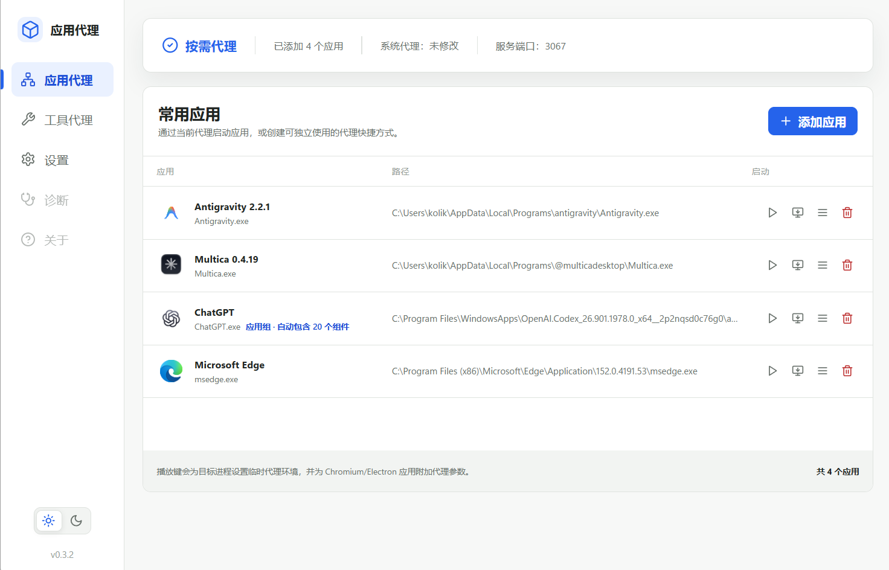

# 应用代理（App Proxy）

一个轻量、开源的 Windows 应用代理启动器。通过本地 SOCKS、HTTP 或 HTTPS 代理按需启动应用，不修改系统代理。



> 为单个 Windows 应用按需启用代理，并集中管理应用、快捷方式与工具代理。

## 功能

- 从已安装的 Win32 和 Microsoft Store 应用中搜索并添加程序。
- Microsoft Store/MSIX 应用自动按应用组匹配包内组件，例如 ChatGPT 与其 `codex.exe` 子组件。
- 使用环境代理和 Chromium/Electron 启动参数按需启动应用，并可从系统托盘快捷启动。
- 可创建关闭主程序后仍可使用的独立桌面和开始菜单启动器。
- 可自定义快捷方式文件名后缀，默认使用 `-proxy`。
- 工具代理页面可检测、应用和清除 Git 用户级全局代理配置。
- 可从 SOCKS、HTTP、HTTPS 协议中选择并填写代理地址，默认 `http://127.0.0.1:7890`。
- 浅色、深色和系统主题，以及多种主题色。
- 开机自启、连通性检查和安全退出。
- 从 GitHub Releases 检查、验签并安装应用更新；更新前会提示检查 GitHub 网络。

## 安装

从 [Releases](https://github.com/kolikoliko/app-proxy/releases) 下载最新的 Windows x64 安装包：

- 推荐普通用户使用 `AppProxy_*_x64-setup.exe`（NSIS）。
- 需要 MSI 部署时使用 `AppProxy_*_x64_zh-CN.msi`。

首个版本尚未购买商业代码签名证书，Windows SmartScreen 可能显示“未知发布者”。请只从本仓库 Releases 下载，并核对 Release 中的 SHA-256 校验值。

v0.1.0 用户需要手动安装一次 v0.2.0。从 v0.2.0 开始，可在设置页检查和安装后续版本；详细发布流程见 [应用内更新文档](docs/automatic-updates.md)。

## 使用环境代理启动器

先启动本地代理客户端，并确认 SOCKS、HTTP 或 HTTPS 代理端口可用。目标程序需要支持 `HTTP_PROXY`、`HTTPS_PROXY`、`ALL_PROXY` 或 Chromium/Electron 代理参数：

1. 在应用列表右侧点击播放按钮，使用当前代理地址启动一次。
2. 若检测到已有窗口或后台进程，保存工作后确认重启；浏览器的单例进程必须重新启动才能接收代理参数。
3. 点击桌面启动器按钮，可生成“应用名称 + 自定义后缀”的快捷方式，默认示例为 `Chrome-proxy`。以后即使应用代理没有运行，也可以通过该快捷方式启动。

启动器只为目标进程树设置临时环境变量，本身不修改 Windows、Git 或 npm 的全局代理；如需管理 Git 全局代理，可使用“工具代理”页面。普通程序是否生效取决于其自身是否支持代理环境变量；ChatGPT、Chrome、Edge、VS Code 等 Chromium/Electron 应用会自动附加代理启动参数。修改代理地址后，请重新点击创建按钮以刷新桌面启动器配置。

## 当前限制

- 首发仅提供 Windows 10/11 x64 构建。
- 普通 Win32 软件按所选 `.exe` 精确匹配；Microsoft Store/MSIX 应用支持包内应用组。
- 本项目不提供节点、订阅或代理服务，必须配合现有本地代理使用。
- 环境启动器不能代理忽略环境变量且不支持代理启动参数的应用。
- 安装包暂未进行 Authenticode 商业代码签名。

## 本地开发

需要 Node.js、Rust 和 Windows WebView2：

```powershell
npm install
npm run tauri dev
```

仅运行浏览器界面：

```powershell
npm run dev
```

构建安装包：

```powershell
npm run tauri build
```

## 安全与隐私

规则和设置只保存在本机。程序不读取 HTTPS 内容，不上传访问历史，也不提供远程控制。安全问题请按照 [SECURITY.md](SECURITY.md) 私下报告。

## 许可证

项目采用 [GPL-3.0-or-later](LICENSE)。第三方组件信息见 [THIRD_PARTY_NOTICES.md](THIRD_PARTY_NOTICES.md)。本项目与任何代理服务不存在官方隶属关系。
